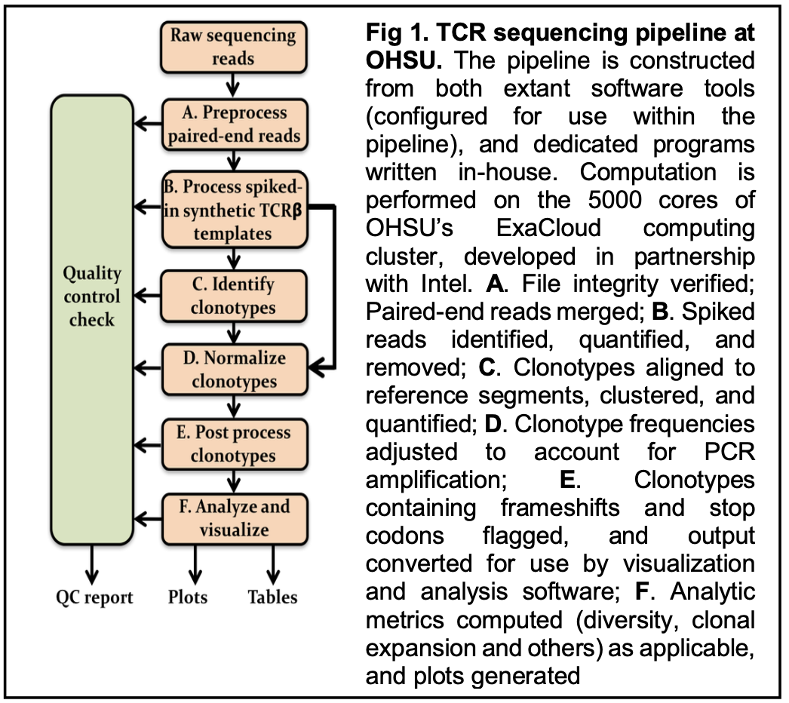

# TCR-seq pipeline

This repository is a collaboration between the Computational Biology Department at OHSU and Lisa Coussens lab for the analysis of TCR-seq data. Our methods have been previously published and hosted by the [CompBio group](https://github.com/ohsu-comp-bio/tcr_sequencing_tools). Currently, our efforts are centered towards reviewing, improving and potentially expanding our analysis, therefore, we have found a need to host all the code and project management under Lisa Coussens lab as separate organization on github. There are also efforts towards automating our analysis in the future and have a similar project under Galaxy and the SMMART group at OHSU, which will be then, hosted under the CompBio group. 

Most of the work done on this pipeline have been achieved through the hard work of previous contributors at OHSU, especially Wes Horton, whom we are very grateful. For new directions and updates on the status of the project, follow our Projects/Zenhub tabs and, by all means, feel free to create issues and reach out to our group. 

Thank you!


TCR-SEQ TOOLS
============

This repository contains all of the tools needed to run a TCRseq pipeline from accessing the files on nix (formerly mpssr) to performing QC on output.




GENERAL NOTES
==============

Remember to create an interactive job on ExaCloud when running interactive and computationally-intensive jobs.  For example:

     `~% srun --mincpus 4 --mem 4G --time 1-00 --pty bash`

The new servers (exahead1 and exahead2) use the slurm job scheduler, not condor, the first command will no longer work. 

> Use `nohup` command to prevent interuption such as `nohup sbatch 30_sbatchMixcrAnalyze.sh &`. This will also generate a log of job submissions named nohup.txt, which is useful for troubleshooting  in case of slurm failure.

> Word of advice: Check to see if all files were output correctly before moving to next step of the pipeline by running `ls -v`

PIPELINE OVERVIEW
=================

This overview of the pipeline connects the scripts being run in each step along with the directories which results
are being sent to. 

```

├── 1. Update bash profile
    ├── $data
    └──$tool
├── 2. Set up directory structure
    ├──fastqs_from_core/  
    ├──gliph/  
    ├──normalization/  
    ├──QC/
    ├──freqGroups/  
    ├──mixcr/  
    ├──peared_fastqs/
    ├──spike_counts/
    ├──slurm_logs/
    └──tools/
├── 3. Copy files from nix to exacloud with `rsync -rv` command
├── 4. run MultiQC & analyze html report
	└── multiqc --interactive --export
├── 5. Check fastq.gz file transfer from nix
	├──IN=$data/fastqs_from_core/fastqs/
        └──MYBIN=$tool/10_preProcess/00_process.md5.R
├── 6. Rename files
    └── 01_rename_fastqs.R
├── 7. Unzip files for downstream analysis
    └── 02_sbatchUnzip.sh
        └──IN=$data/fastqs_from_core/fastqs 
├── 8. Run PEAR to concatenate files
    └── 03_sbatchPear.sh 
        ├──IN=$data/fastqs_from_core/fastqs
        ├──OUT=$data/peared_fastqs/ 
        ├──MYBIN=$tool/10_preProcess/03_pear.pl
        └──QC=$data/QC/pear/
├── 9. Process spikes
    ├── Count
    │   ├── 9bp
    │   |   └──10_sbatchCountSpikes9.sh
    │   |      ├──IN=$data/peared_fastqs/assembled
    │   |      ├──OUT=$data/spike_counts/9bp/ 
    │   |      └──MYBIN=$tool/20_processSpikes/count.spikes.R
    │   └── 25bp
    │       └──10_sbatchCountSpikes25.sh
    │           ├──IN=$data/peared_fastqs/assembled
    │           ├──OUT=$data/spike_counts/25bp/ 
    │           └──MYBIN=$tool/20_processSpikes/count.spikes.R
    └── Remove
        └── 20_sbatchRemoveSpikes.sh 
            ├──IN=$data/peared_fastqs/assembled 
            ├──TOREM=$data/spike_counts/9bp/reads_to_remove
            ├──OUT=$data/mixcr/despiked_fastqs
            ├──REMOUT=$data/spike_counts/9bp/spikes
            └──MYBIN=$tool/20_processSpikes/remove.spikes.R 
├── 10. Identify Clotypes
    └── DNA
       ├── 30_sbatchMixcrAlign.sh
       ├── IN=$data/mixcr/despiked_fastqs
       ├── OUT=$data/mixcr/
       ├── REPORTDIR=$data/mixcr/reports/
       ├── PRESET=$tool/30_mixcr/analyze_preset.txt
       └── MYBIN=$tool/30_mixcr/mixcr-3.0.3/mixcr.jar
├── 11. Decontaminate
    └── 40_sbatchDecontaminate.sh
          ├── IN=$data/mixcr/export_clones/
          ├── OUT=$data/normalization/decontam/
          ├── QC=$data/QC/std/
          └── MYBIN=$tool/40_postProcess/decontaminateClones.R
├── 12. Normalize
    ├── calculate.scaling.factor.R
    └── 50_sbatchNormalize.sh
          ├── IN=$data/normalization/
          ├── REF=$tool/40_postProcess/nb_counts/
          └── MYBIN=$tool/40_postProcess/normalizeClones.R
├── 13. PostProcess
    └── 60_sbatchQC.sh
├── 14. Analyze
    ├── 70_sbatchDiversityAnalysis.sh
    |     ├── IN=$data/normalization/normalized_clones/ 
    |     ├── MYBIN=$tool/60_analysis/diversityAnalysis.R
    |     └── OUT=$data/QC/std/
    |           └── IN=count.spikes.25bp.QC.summary.txt
    |           └── IN=count.spikes.9bp.QC.summary.txt
    |           └── IN=contaminationQC.txt
    |           └── IN=mixcr.alignment.QC.summary.txt
    |           └── IN=mixcr.assembly.QC.summary.txt
    |           └── IN=remove.spikes.QC.result.txt
    |           └── OUT=LIBXXXXXX.txt
    ├── 71_sbatchSubsetDiversityAnalysis.sh
    |     ├── IN=$data/normalization/normalized_clones/ 
    |     ├── MYBIN=$tool/60_analysis/subsetDiversityAnalysis.R 
    |     └── OUT=$data/QC/std/ 
    ├── 72_sbatchFreqGroupDiversityAnalysis.sh
    |     ├── IN=$data/freqGroups/BATCH_full_clones.txt 
    |     ├── MYBIN=$tool/60_analysis/freqGroupDiversityAnalysis.R  
    |     └── OUT=$data/QC/std/
    ├── 80_sbatchClonalDivisionSummary.sh  # clonotype homeostasis analysis
    |     ├── IN=$data/normalization/normalized_clones/ 
    |     ├── META=$data/QC/meta/meta.txt
    |     ├── MYBIN=$tool/60_analysis/clonalDivisionSummary.R
    |     └── OUT=$data/QC/cloneDiv/
    |           └── OUT=cumFreqHomeo.pdf
    |           └── OUT=cumHomeo.xlsx
    |           └── OUT=meanHomeo.xlsx
    ├── 90_sbatchGroupClones.sh  # by different frequency types
    |     ├── IN=$data/normalization/normalized_clones/ 
    |      ├── MYBIN=$tool/60_analysis/groupClones.R
    |      ├── META=$data/QC/meta/meta.txt
    |      └── OUT=$data/freqGroups/
    └── 91_sbatchGroupClones.sh  # by different frequency types
          ├── IN1=$data/normalization/collapsed_clones/
          ├── IN2=$data/freqGroups/collapse_groupData/newNorm/LIB170920LC_full_clones.txt
          ├── OUT=$data/vdjtools/
          ├── MYBIN=$tool/60_analysis/subsetByGroup.R
          └── QC=$data/QC/
├── 15. Generate summary Output
    └── 61_sbatchPlotQC.sh
    	├── pearQC.R
    	├── readAndCloneQC.R
	├── readAndContamQC.R
    	├── spikeQC.R
    	└── fastQC_sequenceQuality.R
``` 

RUNNING THE PIPELINE: DIRECTORY SET UP & ENV VARS
=================================================

1. Log into exacloud via the exahead1 server:

    ```
    ~$ ssh userName@exahead1.ohsu.edu
    ~$ <enter password>
    ```

2. Create a location on ExaCloud for storing the project files, by creating a new directory in the tcrseq project area:

    ```
     ~$ cd /home/exacloud/gscratch/CoussensLab/tcr_analysis
     ~$ mkdir DNAXXXXXLC
     ```

3. Create environment variables for the data and tool directories for easy access to them. You will also need these to be set for the condor\_submit scripts to work correctly.

    a. Open your `~/.bash_profile` (or `~/.bashrc`)

    `~$ emacs .bash\_profile` or `~$ emacs .bashrc`

    b. Enter these lines:

     ```
     data=/home/exacloud/gscratch/CoussensLab/tcr_analysis/NEW_LIBXXXXXXLC
     export data
     tool=/home/exacloud/gscratch/CoussensLab/tcr_sequencing_tools  # path to the tools used to run this pipeline
     export tool
     ```

    c. Don't forget to source: `~$ . ~/.bashrc`

    d. In the directory you created, generate the following folder structure by calling `~$ sh $tool/setup.sh`. If you are running an RNAseq analysis, just add any character string as an argument, in order to get the appropriate directory structre: `~$ sh $tool/setup.sh y`.

```
        ├── fastqs_from_core
        │   ├── extras
        │   ├── FastQC
        │   │   ├── html
        │   │   ├── unzipped
        │   │   └── zip
        │   ├── fastqs
        │   ├── md5
        │   └── QC_recopy
        ├── mixcr
        │   ├── alignments
        │   ├── assemblies
        │   ├── despiked_fastqs
        │   ├── export_align
        │   ├── export_clones
        │   ├── empty_clones
        │   ├── indexes
        │   └── reports
        │       ├── align
        │       └── assemble
        ├── normalization
        │   ├── decontam
        │   ├── counts
        │   ├── normalized_clones
        │   └── QC
        ├── peared_fastqs
        │   ├── assembled
        │   ├── discarded
        │   ├── QC_recopy
        │   │   ├── assembled
        │   │   ├── discarded
        │   │   └── unassembled
        │   └── unassembled
        ├── QC
        ├── spike_counts
        │   ├── 25bp
        │   │   ├── counts
        │   │   ├── qc
        │   │   ├── spikes
        │   │   ├── empty
        │   │   └── reads_to_remove
        │   └── 9bp
        │       ├── counts
        │       ├── qc
        │       └── reads_to_remove
        ├── freqGroups
        │   ├── baseLine
        │   ├── groupData
        │   ├── overLapResults
	    └── treatSpecificClones
        ├── gliph
        │   ├── byTreat
        │   │   ├── clones
        │   │   └── results
        │   ├── specificTreat
        │   │   ├── clones
        │   │   └── results
	    └── todo
        └── tools
            ├── condor_formats
            │   ├── 01_format.unzip.R
            │   ├── 02_format.pear.R
            │   ├── 10_format.count.spikes.R
            │   ├── 20_format.remove.spikes.R
            │   ├── 30_format.mixcr.align.R
            │   ├── 40_format.mixcr.assemble.R
            │   ├── 50_format.export.align.R
            │   ├── 51_format.export.pretty.align.R
            │   ├── 60_format.export.clones.R
            │   └── 80_format.normalize.R
            └── submits
                ├── 00_md5.submit
                ├── 01_unzip.submit
                ├── 02_pear.submit
                ├── 10_count.spikes.9bp.submit
                ├── 10_count.spikes.25bp.submit
                ├── 20_remove.spikes.submit
                ├── 30_align.submit
                ├── 40_assemble.submit
                ├── 50_export.align.submit
                ├── 51_export_align_pretty.submit
                ├── 60_export.clones.submit
                ├── 70_decontaminate.submit
                ├── 80_normalize.submit
                ├── 90_runQC.submit
                └── 100_analysis.submit
```

 Unless otherwise stated, instructions below assume that you're at the root of the directory structure stated immediately above.

PREPROCESS
===========

## Copy Files
The Core places the files on their IGL server, nix (formerly mpssr). You will need access to this server in order to copy files to exacloud.

1. Use the instructions provided by the Core to find the files on the IGL server.  (You can ssh into the server if necessary – the Core typically provides a temporary password giving you access for ~two weeks. Run `cd /data/LIBXXXXXXLC` for the given library and the directory right bellow. Run `ls` to find this directory structure

```
    FastQC  LIB200902LC  readme.txt  Reports  Stats
```

2. From this directory in nix, use rsync to copy the fastq and FASTQC files from the Core's IGL server (nix) to the fastqs\_from\_core directory on ExaCloud. For example:  

     ```
    rsync -rv FastQC/* username@exacloud.ohsu.edu:/home/exacloud/gscratch/CoussensLab/tcr_analysis/LIBXXXXXXLC/fastqs_from_core/FastQC
    rsync -rv LIBXXXXXXLC/* username@exacloud.ohsu.edu:/home/exacloud/gscratch/CoussensLab/tcr_analysis/LIBXXXXXXLC/fastqs_from_core/fastqs
     ```

3. Back to gscratch on exacloud, copy the FASTQC files over to the corresponding directory (for example, html: `mv *.html html/`). The rest of the data can be copied to "extras".

## FastQC
1. Inspect the fastQC files to identify any problematic samples. MultiQC generates an html file that we will have to transfer to our local machine to view. We first have to run MultiQC. To do this, you must either specify the full path to the MultiQC executable, or add `export PATH="/home/exacloud/lustre1/BioCoders/Applications/miniconda3/bin:$PATH"` to your `~/.bashrc` or `~/.bash_profile`. This example assumes you have not added the conda path.

     ```
     ~$  pwd
     /path/to/DNAXXXXLC/fastqs\_from\_core/FastQC/
     ~$ srun --mincpus 1 --mem 16G --time 0-12 --pty bash
     ~$ /path/to/BioCoders/Applications/miniconda3/bin/multiqc --interactive --export .
     ```

2. A new file called `multiqc_report.html` will be created in the FastQC directory. Create a directory under the TCRseq Box folder and save it. Open with a web browser and discuss library quality.

     ```
     # THIS IS ON LOCAL COMPUTER # 
     ~$ pwd
     /Users/username/Box/TCRseq/results/LIB200630LC/multiqc/
     ~$ scp username@exacloud:/path/to/DNAXXXXLC/fastqs\_from\_core/FastQC/multiqc_report.html .
     ~$ open multiqc_report.html
     ```


## MD5sums
Verify that your file transfer was successful by calculating the MD5sums of the files and comparing them to the MD5sums provided by the core.  

1. The process.md5.R script will compute the MD5sums for the files, which can be checked with those provided by the core:
     ```
     ~% cd $tool/slurm
     ~% sbatch 00_sbatchmd5.sh
     ```
1. Compare to core values
     ```
     ~$ diff DNAXXXXXXLC/calculated.md5.sums.txt DNAXXXXXXLC/md5sum.sorted.txt
     ```
1. If any MD5sums differ, retransfer the appropriate files and recheck their MD5sums. Move the three MD5sums files into the md5 directory.

Rename
=======
The naming conventions used by IGL introduce an extra sample tag that is unnesseccary. We want to remove that. 
Optionally, we can remove 1 other field, if there happens to be a treatment designation or something that is also included.

```
~$ Rscript $tool/10_preProcess/01_rename_fastqs.R /path/to/fastqs/ /path/to/QC/
```

UnZip
=====
The files are zipped to allow fast transfer from nix, but need to be unzipped for the remainder of the pipeline.  
We will now begin using the slurm job scheduler to run our jobs. For each step, there is generally a .sh or .R file that runs the program,
and an sbatch script that will submit the program to the job scheduler. A few modifications to the sbatch scripts will need to be made.

```
~$ cd $data/tools/slurm
~$ vi 02_sbatchUnzip.sh
< change --array argument to be 0-X, where X is the largest tens place in your files. 130 files would be 0-13 >
~$ sbatch 02_sbatchUnzip.sh
~$ mv unzip_* $data/slurm_logs/setup/ 
```

After each step, move the .out and .err files to the appropriate log directory.
For subsequent steps, 'todo' files will be created, which is described below. If you are running an RNAseq pipeline, you can skip the PEAR and PROCESS SPIKES steps.

PEAR
=====
We receive paired-end sequencing files from IGL. Before we can use these files in later steps, we need to merge the forward and reverse reads. 
We do this using PEAR.

```
~$ cd $data/fastqs_from_core/fastqs
~$ ls -v *_R1_* > $data/tools/todo/pear.txt
~$ cd $data/tools/slurm/
~$ vi 03_sbatchPear.sh
< change --array argument to be 1-X, where X is the number of files. 130 files would be 1-130 >
~$ sbatch 03_sbatchPear.sh
```

Sometimes the job scheduler is pretty busy and running an entire batch at once causes some of the jobs to fail.  
Instead of running them all at the same time, you can utilize the `runSbatch.sh` script. This script will submit jobs in batches of 10,
waiting for one set of 10 to finish before submitting another. If there were 130 samples in a batch, it would look like:

```
~$ sbatch runSbatch.sh 03_sbatchPear.sh 130
```

The PEAR program produces fastq files of the assembled reads, but it also produces files containing all discarded reads, 
as well as all unassembled reads. Everything is output the the `$data/peared_fastqs/` directory. All files must be moved to their corresponding directories.

PROCESS SPIKES
===============
## Count Spikes
From now on, we will only be using the assembled fastq files in the analysis. Our reads have synthetic spike-ins along with the TCR DNA. 
We use a 9-bp barcode to remove all spikes, and a 25-bp barcode to quantify the levels of each spike.

```
~$ cd $data/peared_fastqs/assembled/
~$ ls -v * > $data/tools/todo/count9.txt
~$ cd $data/tools/slurm
~$ vi 10_sbatchCountSpikes9.sh
< change --array argument to be 1-X >
~$ sbatch 10_sbatchCountSpikes9.sh
```
Run this for both 9bp and 25bp.  

## Remove spikes
We need to remove all of the spike-in sequences from our fastq files so that we only submit true TCR sequences to MiXCR. 
This uses the same base input as count spikes, so you can do: `cp $data/tools/todo/count9.txt $data/tools/todo/despike.txt`. Then just
open `20_sbatchRemoveSpikes.sh` and change the `--array` variable, as previously described, and submit. 

IDENTIFY CLONOTYPES
===================
Our reads are finally ready to be processed through the MiXCR analysis pipeline. For more information check MiXCR software [documetation](https://mixcr.readthedocs.io/en/master/quickstart.html), [github](https://github.com/milaboratory/mixcr/tree/master) and [releases](https://github.com/milaboratory/mixcr/releases).


This process differs depending on if the data are DNA or RNA. 

## DNA 

Now with MiXCR version 3.0+, there is only one tool, `analyze`, which will run all of the old `align`, `assemble`, and `export` modules. Either create the `todo/analyze.txt` file using the `mixcr/despiked_fastqs` directory, or use the non-todo method. 

```
~$ 30_sbatchMixcrAnalyze.sh <--------> todo/align.txt
```

**Old version: MiXCR version 2.x**  
We use three tools from the MiXCR suite: `align`, `assemble`, and `export`. Generally use the output of the previous command to form the "todo" file of the next command. 
So the files in `despiked` go into `todo/align.txt`, the files in `align` will go into `todo/assemble.txt`, and the files in `assemble` will go into `todo/exportClones.txt`.
The tool `50_sbatchMixcrExportAlign.sh` is not used in the standard pipeline and only needs to be run when troubleshooting. For each tool, create the todo file, edit the array argument, submit the sbatch,
move the log files, and continue to the next tool. 

You must complete `align` before you can run `assemble`. 

```
~$ 30_sbatchMixcrAlign.sh <--------> todo/align.txt
~$ 40_sbatchMixcrAssemble.sh <-----> todo/assemble.txt
~$ 60_sbatchMixcrExportClones.sh <-> todo/exportClones.txt
```

_Important:_ check before you proceed to the next step

Sometimes a few of the clonotype files do not properly form. To check that `exportClones` has run successfully, 
run: `sh $tool/misc/check_clones.sh /path/to/export_clones`. If any files are output, 
go to your submission file and re-run only those files by commenting out the rest.

## RNA
**Note** this has not been updated for MiXCR 3.0+!! 
Due to the nature of randomly digested RNAseq data, a few extra steps need to be taken to reliably identify clones. The RNAseq-specific submission files are in
`$data/tools/slurm/rnaseq`. The same principle applies, however, of creating a todo file from the previous step's output, editing the array argument for the appropriate
number of samples, submitting, and moving the log files. The steps for this are:

```
~$ 31_sbatchMixcrAlignRNAseq.sh <------> todo/align.txt
~$ 41_sbatchMixcrAssemblePartial1.sh <-> todo/partial1.txt
~$ 42_sbatchMixcrAssemblePartial2.sh <-> todo/partial2.txt
~$ 51_sbatchMixcrExtendAlign.sh <------> todo/extend.txt
~$ 55_sbatchMixcrAssemble.sh <---------> todo/assemble.txt
~$ 60_sbatchMixcrExportClones.sh <-----> todo/exportClones.txt
```

DECONTAMINATE
===============
After one of our control sequencing runs, some monoclonal sequences began contaminating our reads. We want to remove them from our files before we do anything else. 
This script works on the entire directory, so there is no todo file. Additionally, downstream steps depend on this format, so be sure to run this even if you don't expect
any contamination.  

```
~$ cd $data/tools/slurm
~$ sbatch 40_sbatchDecontaminate.sh
```

NORMALIZE
==========  
Skip this step if you have RNAseq data.  
We have to do some more pre-processing before we are ready to normalize. 
1. Copy the 25-bp spike files to the normalization directory.
    ```
    ~$ cp $data/spike_counts/25bp/counts/* $data/normalization
    ```
2. Calculate the scaling factor
     ```
     ~$ cd /path/to/normalization/dir/
     ~$ Rscript $tool/40_postProcess/calculate.scaling.factor.R /path/to/normalization/counts/ $tool/00_reference/text_barcodesvj.txt 
     ```
3. Normalize the clones
     ```
     ~$ cd $data/tools/slurm
     ~$ vi 50_sbatchNormalize.sh
       < change --array argument to be 1-X >
     ~$ sbatch 50_sbatchNormalize.sh
     ```


POSTPROCESS
=============
Now we need to run all of the QC scripts. Each script can be run individually, 
but they have been placed inside of a bash script that will run them all simultaneously.
```
~$ cd $data/tools/slurm
~$ sbatch 60_sbatchQC.sh
```
After running the script above, you should have the following files under the `$data/QC/std/` directory:
```
count.spikes.25bp.QC.summary.txt  
count.spikes.9bp.QC.summary.txt  
LIBXXXXXXLC_contaminationQC.txt  
mixcr.alignment.QC.summary.txt  
mixcr.assembly.QC.summary.txt  
remove.spikes.QC.result.txt
```

ANALYZE
========
There are a few different standard analyses that can be run. For meaningful information, you are going to need to upload a meta.txt file based on the data provided from lab technician during library prep (check other analyzed samples for more details). Save the metadata to the current library's path: `$data/QC/meta/`, as it is called in the bash scripts bellow.


1. Run _Diversity Analysis_ with `70_sbatchDiversityAnalysis.sh` which generates a text file containing standard diversity statistics such as clonality, shannon entropy, etc. There are also variations of this script that allow you to subset for clones 
of certain frequency groups only or certain numbers of top clones (see below). 

2. Run _Group clones_ with `90_sbatchGroupClones.sh` to generate different frequency classifications that will be used for other downstream analysis

3. Run _Diversity Analysis on a subset_ with `71_sbatchSubsetDiversityAnalysis.sh` on the top clones to calculate Shannon Entropy, unique clones, max clone count, gini index, etc.

4. Run _Frequent Groups Diversity Analysis_ with the script `72_sbatchFreqGroupDiversityAnalysis.sh` to get diversity analysis on selected group (Hyperexpanded, Large, Medium, Rare).

5. Run _Clonotype Homeostasis Analysis_ with `80_sbatchClonalDivisionSummary.sh` which creates a few excel workbooks and some homeostasis plots. Depending on the experiment, you may or may not have some of the columns on the metadata (for example, tissue and type). This post-analysis is highly customizable. 

 

Summary Output
===============

Prepare a **powerpoint presentation** for discussing both multiQC.html reports results (read quality) and output metrics from the softwares used in the pipeline in the `60_sbatchQC.sh` in order to remove problematic samples from the final analysis. 

Run `61_sbatchPlotQC.sh` to run multiple R scripts and generate plots for reads, contamination, spike count, PEAR and FastQC.


After running all of the QC scripts, and the analysis, combine the outputs into an **excel workbook**. 
Run the combineQC.R script in the QC tool directory:

```
~$ Rscript $tool/QC/combineQC.R /path/to/QC/dir /path/to/QC/dir
```


